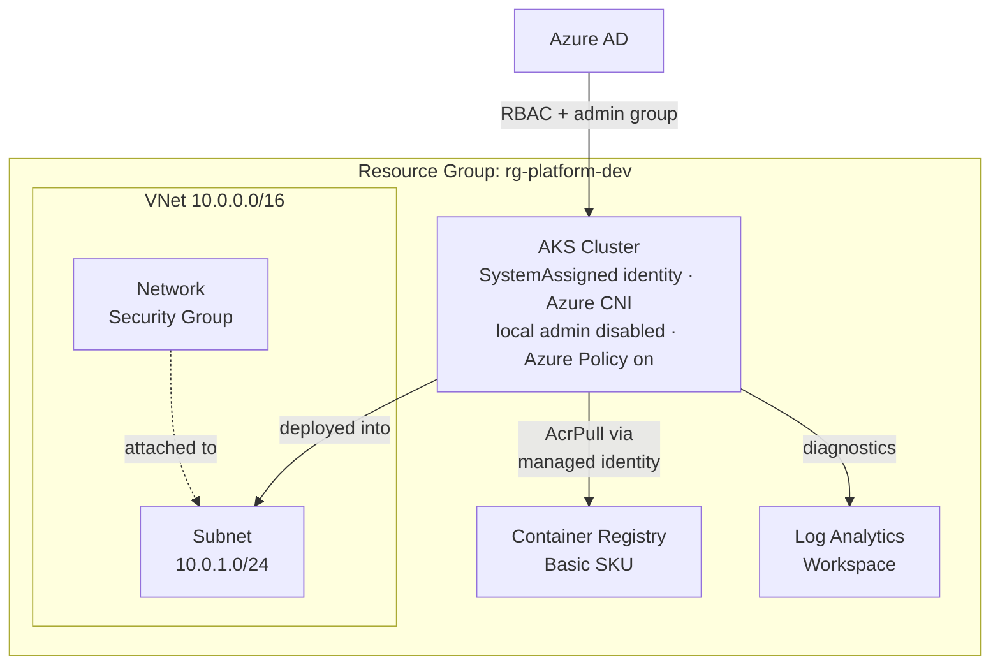
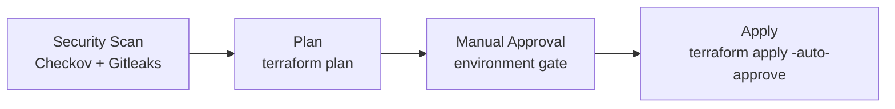

# Azure Environment Automation

A Terraform-driven Azure platform environment a private network, an AKS cluster, and a container registry where every component, connection, and access rule is defined in code and provisioned through a reviewed, auditable pipeline instead of the Azure Portal.

## What gets provisioned



No credentials connect the cluster to the registry the AKS kubelet identity is granted the `AcrPull` role directly via Azure RBAC. Nothing to store, rotate, or leak.

## Repository structure

```
.
├── modules/
│   ├── vnet/     # Virtual network, subnet, and NSG
│   ├── acr/      # Container registry
│   └── aks/      # AKS cluster + AcrPull role assignment
├── environments/
│   └── dev/      # Root module wiring the three modules together for dev
├── azure-pipelines.yml   # Security scan → plan → manual approval → apply
├── decisions.md          # Running log of architectural decisions and trade-offs
└── LICENSE
```

Each module under `modules/` is self-contained (its own `variables.tf`/`outputs.tf`) so the same building blocks can be reused for additional environments - `environments/dev` is the only one wired up today.

## Prerequisites

- [Terraform](https://developer.hashicorp.com/terraform/downloads) `~> 1.x`
- An Azure subscription, and an identity with rights to create resource groups, networking, AKS, and ACR
- An existing storage account for remote state (see `environments/dev/backend.tf`)
- An Azure AD group whose object ID will be granted `admin_group_object_ids` on the cluster (see [`admin_group_object_id`](environments/dev/variables.tf))

## Usage

```bash
cd environments/dev

# Authenticate first - either `az login` or export ARM_* env vars
# (ARM_CLIENT_ID, ARM_CLIENT_SECRET, ARM_TENANT_ID, ARM_SUBSCRIPTION_ID)

terraform init
terraform plan -var-file="terraform.tfvars"
terraform apply -var-file="terraform.tfvars"
```

## CI/CD pipeline

[azure-pipelines.yml](azure-pipelines.yml) runs on every push to `main`:



1. **Security scan** - [Checkov](https://www.checkov.io/) for IaC misconfigurations and [Gitleaks](https://github.com/gitleaks/gitleaks) for committed secrets
2. **Plan** - `terraform plan` against the dev environment
3. **Manual approval** - an Azure DevOps environment gate; nothing reaches Azure without a human reviewing the plan
4. **Apply** - `terraform apply -auto-approve`, only after approval

## Security posture

What's already in place, and why - full reasoning for each in [decisions.md](decisions.md):

| Control | Status |
|---|---|
| Local admin account on AKS | Disabled - all access via Azure AD |
| Kubernetes authorization | Azure RBAC |
| AKS → ACR authentication | Managed identity (`AcrPull` role), no credentials |
| Subnet-level traffic control | NSG attached to every subnet |
| Cluster identity | SystemAssigned managed identity |
| Diagnostics/audit logging | Forwarded to Log Analytics |
| Policy enforcement | Azure Policy add-on enabled |
| IaC scanning | Checkov, on every pipeline run |
| Secret scanning | Gitleaks, on every pipeline run |
| State isolation | One state file per environment |

## Roadmap

- [ ] Key Vault module + Secrets Store CSI driver
- [ ] Separate system/user AKS node pools
- [ ] To add `staging` and `prod` environments, reusing the existing modules
- [ ] Private AKS cluster for prod
- [ ] GitOps, observability, and governance layers

## License

[MIT](LICENSE)
